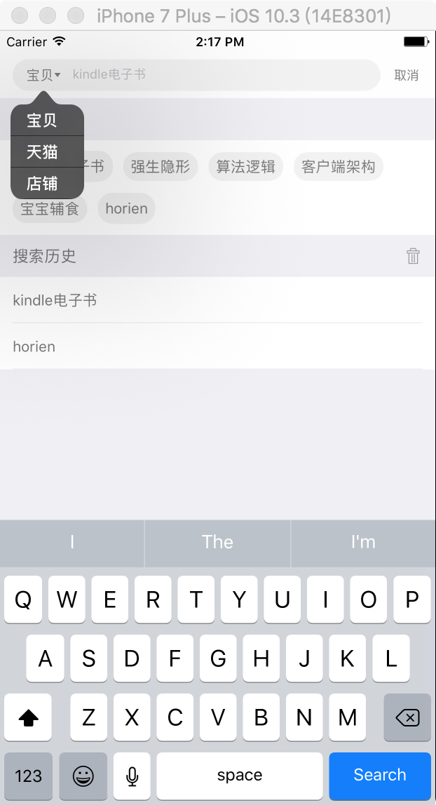

##ABOUT
JDSearchView is a normal search module which can by used everywhere,especially for e-commerce. 
Using this searchView,you can see the following feature:
- first,providing options which you may interests.
- second,storing personal search history.
What's more,you can easily integrate it into your project.
##PreView

